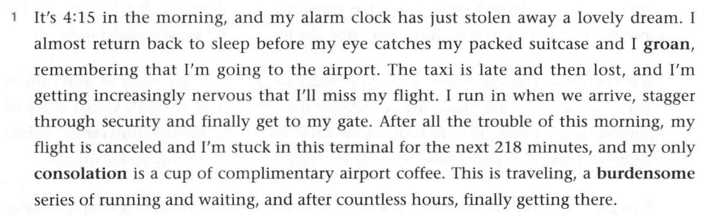
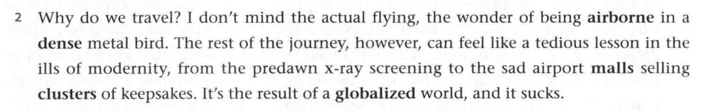
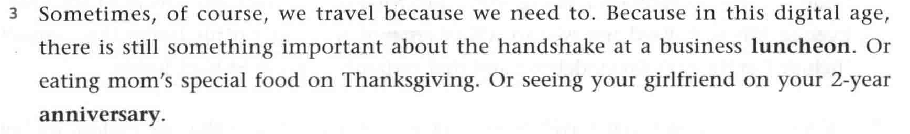
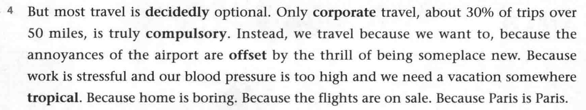
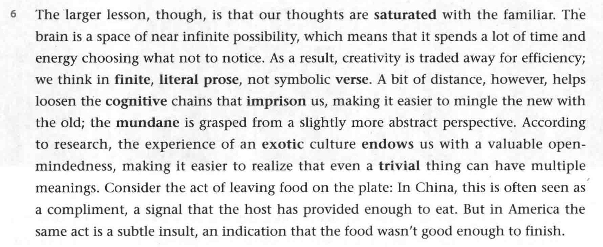
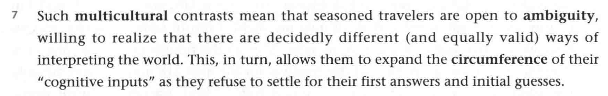
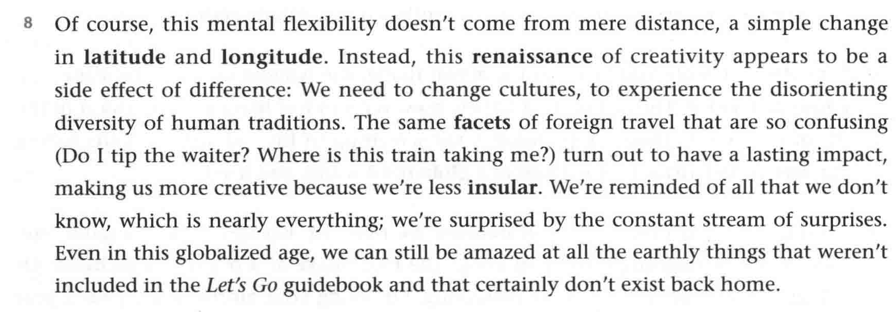

# BOOK3 UNIT4

## 第一课时

#### Before class

---

- **dyansty** *`n.`* 朝；朝代

#### Section A

---

- **groan** *`vi.`* 呻吟；因为抱怨发出哼哼声
- **increasingly** *`adv.`* 越来越
  get **increasingly** nervous 变得越来越紧张
- **stagger** *`adv.`* 急匆匆的
- **cancel** *`v.`* 取消
- stuck in 被困在...
- **consolation** *`n.`* 安慰
- complimentary *`adj.`* 免费的
- **burdensome** *`adj.`* 令人烦恼的；成为负担的
- a **series** of 一系列的

---

- **airborne** *`adj.`* 在空气中的；飞行的
- **dense** *`adj.`* 密度大的；紧密的；茂密的(眉毛)
  in a **dense** metal brid 在一个金属大鸟中
- **mall** *`n.`* 商场；购物中心
- **clusters** *`n.`* 集群
- **globalized** *`adj.`* 全球性的

## 第二课时

#### Section A

---

- **luncheon** *`n.`* (正式)午餐
- **anniversary** *`n.`* 纪念日
- **digital age** 信息时代
  digital *`adj.`* 数码的；数字的

---

- **decidedly** *`adv.`* 确实无疑地；显然
- **corporate** *`adj.`* 全体的；集体的
- **compulsory** *`adj`* 义务的；强制的
- **offset** *`vt`* 抵消；补偿 *`n.`* 抵消物

---

- **hemisphere** *`n.`* 半球
- **irony** *`adj.`* 讽刺的；
- **stubborn** *`adj.`* 顽固的；顽强的

## 第三课时

#### Section A

---

- **be saturated with** 被...充满 (filled with sth.)
  **saturate** *`adj.`* 充满的
- **trade ... for ...** 用...交换...
- **verse** *`n.`* 诗歌
- **cognitive** *`adj.`* 认知的
- **imprison** *`v.`* 禁锢
- **mingle ... with** ... 使...与...混合
- **mundane** *`adj.`* 平凡的；平淡无奇的
- **exotic** *`adj.`* 异国情调的
- **endows ... with ...** 赋予
- **trivial things** 琐碎的事情
  **trivial** *`adj.`* 没意思的
- consider the act of ... 让我们看一下...的情况
- **subtle** 微小的；微妙的
- **insult** *`vt.`* 侮辱

---

- **contrasts** *`v.`* 对比
- **seasoned travelers** 有经验(经常性的)旅游者
- **ambiguity** *`n.`* 模棱两可；不明确
- **interpret** *`v.`* 解释；说明
- **circumference** *`n.`* 周边 *`n.`* [数]周长
  <kbd>词根</kbd>circum~ *`n.`* 周围 circumstance *`n.`* 环境

---

- **latitude** & **longitude** *`n.`* 经度&纬度
- **facet** *`n.`* 方面 
  <kbd>同意词</kbd>aspect 方面
- **insular** *`adj.`* (思想)狭隘的
- globalized age 全球化的时代
- 