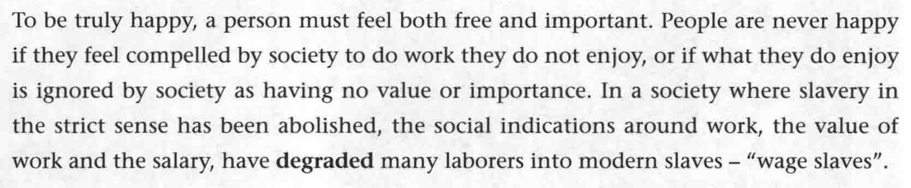
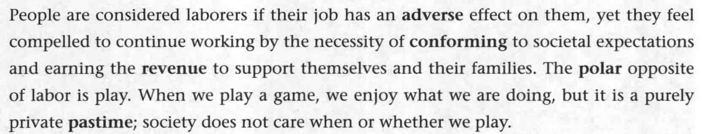
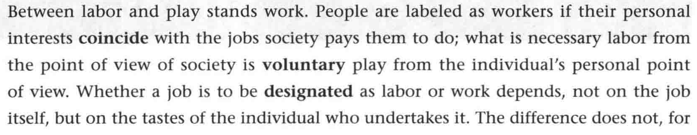
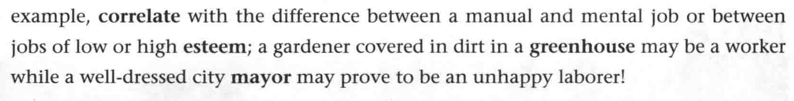

# B3U5

## 第一课时

#### section A

----

- **worker** 指工作者；**laborer** 指劳役者

- slavery *`n.`* 奴隶
- abolish *`vt.`* 废除
- **degrade** *`vt.`* 贬低(某人)
- “wage slave” “薪奴”
  wage *`n.`* 工资

---

- **comform** *`vi.`* 遵循；遵守；服从
- expectation *`n.`* 期望
- purely *`adv.`* 纯粹的
- private pastime 个人的消遣

---

- labeled as 被标为
  label 标签
- **designate** sb. /sth. as 把...描述为；授予...称号
- manual and mental job 体力劳动和脑力劳动工作
- **esteem** *`n.`* 尊重
- **mayor** *`n.`* 市长

#### New words

----

- **revenue** *`n.`*  (公司、机构)收益，收入
- **pastime** *`n.`* 消遣；娱乐
- **correlate** 相互关联
- **prone** *`adj.`* 易于发生的事(负面)
  be **prone** to 很可能做..
- **autonomy** *`n.`* 自主学习；自主
- **precision** *`n.`* 精确性