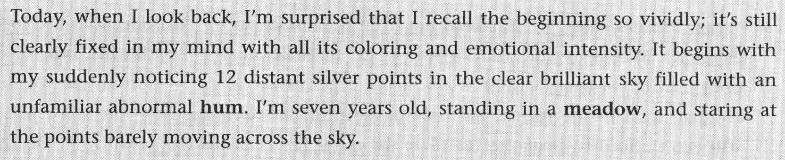
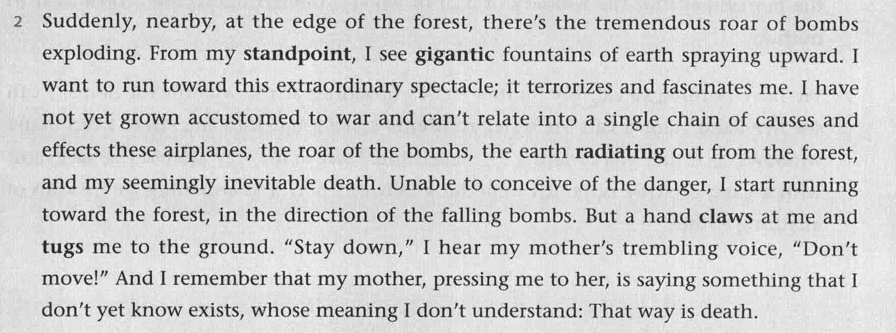
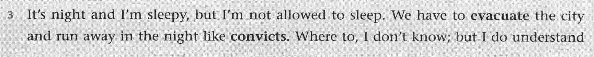
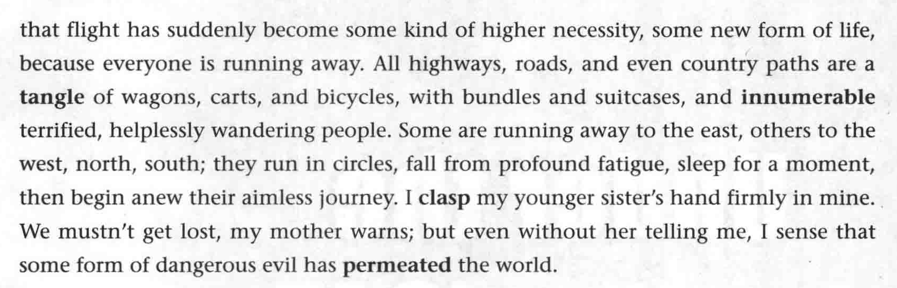
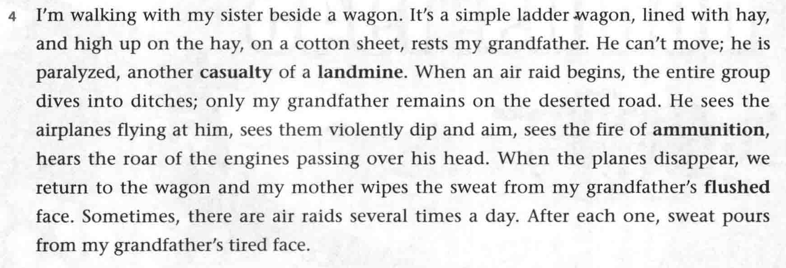
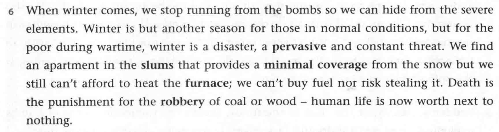
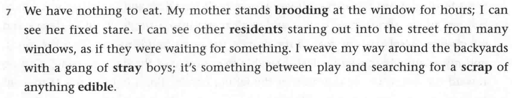
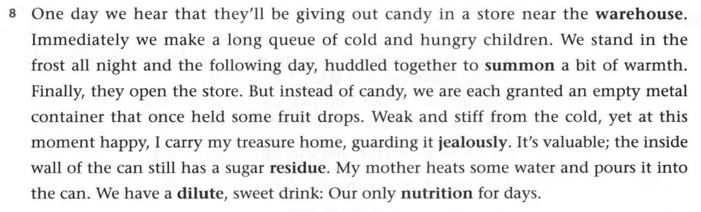
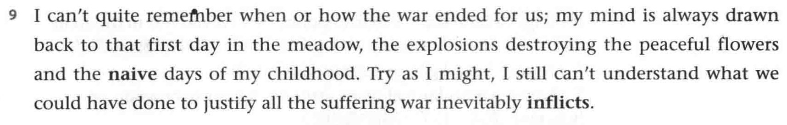

# B3U6

## Section A

- look back 回忆往事
- vividly adv. 生动地
- sth. fixed in one's mind 给某人留下深刻印象
- **hum** n. 嘈杂声，嗡嗡声；v. 哼（曲子）
- stare at 凝视
- **barely** adv. 几乎不

---

- tremendous adj. 巨大的
- roar n. 轰鸣声
- **standpoint** n. [=opinion] 立场
- fountain n. [C]  喷泉
- cause and effect 因果（原因和结果）
- **radiate** vt. 辐射
- inevitable adj. 不可避免的
- conceive of ... 想象...
  *Many people can't conceive of the dinner without meat.*

---

- **evacuate** v. 撤离
- **convict** n. [C] 罪犯；vt. 宣告/证明...有罪
- **tangle**  v. （使）乱成一团；n. 混乱
- **innumerable** adj. 数不清的，无数的
- aimless adj. 无目的的
- **clasp** v. 紧握； n. 扣子
- **permeate** v. 渗透，透过

---

- **line with** 用...铺满

  *line with hey 铺满了干草*

- **casualty** n. [C] 受害者；伤亡人员

- **landmine** n. [C] 地雷

- air raid 空袭

- **dive into** 跳入，钻进

- **fly at** 扑向​

---

- **pervasive** adj. 始终贯穿，显而易见
- **slums** n. 贫民窟
- **furnace** n. 火炉
- Death is the punishment for 给...判死刑
- 

---

- **brood** v. 担忧
- **resident** n. 居民
- weave one's way around ...  某人迂回穿行于...
- a **scrap** of 一小块 
  **scrap** v. 刮掉 n. 碎片，小块
- **edible** adj. 可食用的；能吃的

---

- **warehouse** n. 仓库
- **jealously** adj. [1]小心守护地 [2]嫉妒的，羡慕的
- **residue** n. 残渣，余留
- **dilute** adj. 冲淡的
- **nutrition** n. 养分，食物

---

- **meadow** n. 草地
- **naive** adj. 天真的
- 

