# B3U7

## Before class

## New words

## Section A

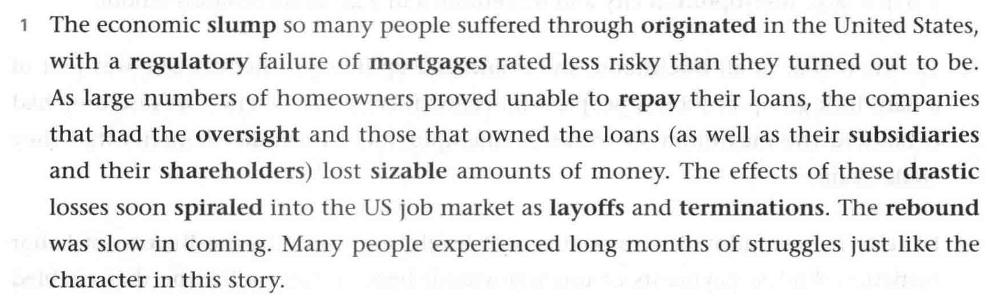

- **slump** n. 不景气，萧条
- **originate** v. 起源，发起  <kbd>同根词</kbd>origin n. 起源
- **regulatory** adj. 监管的
- **mortgage** n. 抵押贷款 v. 抵押
- **repay** v. 偿还
- **oversight** n. 监管，监督
- **subsidiary** n. 子公司
- **shareholder** n. 股东
- **sizable** adj. 巨大的
- **drastic** adj. 激烈的；厉害的；突然的
- **spiral** vi. 不断恶化 n. 螺旋；螺旋线 adj. 螺旋的

- **layoff** n. 裁员；解雇
- **termination** n. 结束，终止
- **rebound** n. 复兴，振兴；回弹

---

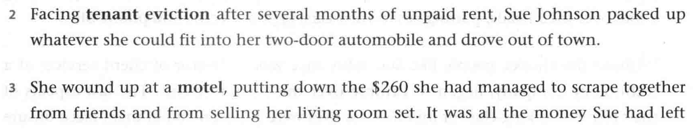

- **tenant** n. 房客；租户
- **eviction** n. 驱逐
- pack up 打包；收拾卷起
- fit into 塞进
- wound(wind) up ... 结果 ... [=end up]
- scrape together (勉强)凑足
- unemployment benefits 失业金
- **expire** vi. 失效，终止；到期
- **metropolitan** adj. 大城市的

---

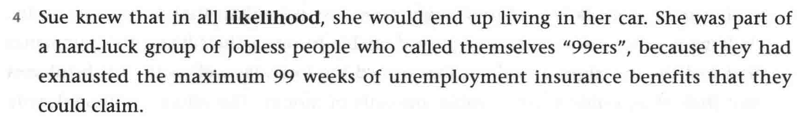

- **likelihood** n. 几乎肯定的；极可能的
- exhaust 耗尽；使筋疲力尽
- maximum n. 极大
- unemployment insurance benefits 失业保险救济金

---

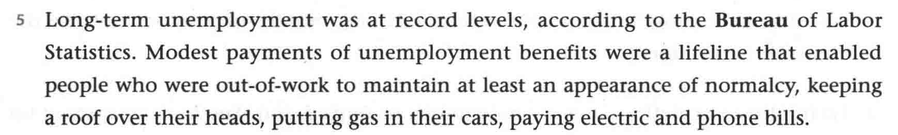

- **bureau** n. 局

----

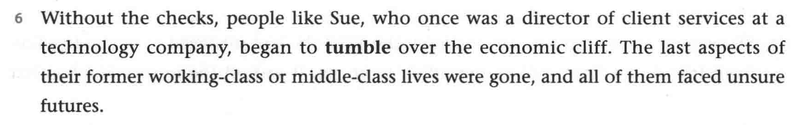

- tumble over the economic cliff 跌下经济悬崖
- working-class adj. 工人阶级的
- middle-class adj. 中产阶级的

---

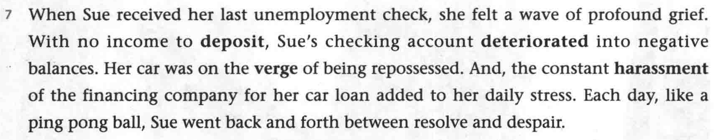

- **deposit** v.存入 n. 存款；定金

- **deteriorate** v. 恶化

  deteriorate into 恶化成

- on the **verge** of 在 ... 的边缘

  **verge** n. 边缘；v. 接近；趋向

- repossess vt. 收回

- **harassment** n. 骚扰

- despair n. 绝望

---

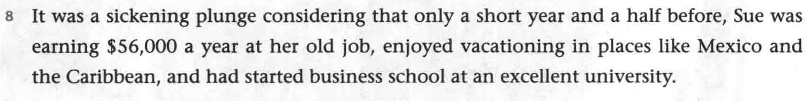

- a short year and a half before 一年半以前

---

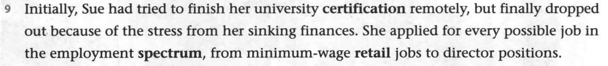

- **certification** n. 证书

- employment **spectrum**  就业范围

  **spectrum** n. 范围；光谱；频谱

---

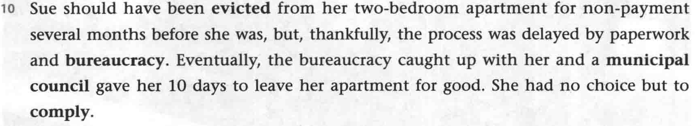

- **evict** v. 驱逐
- paperwork n. 文书工作
- **bureaucracy** n. 官僚主义
- **municipal** adj. 市政的
- **council** n. 委员会
- **comply** vi. 遵守

---

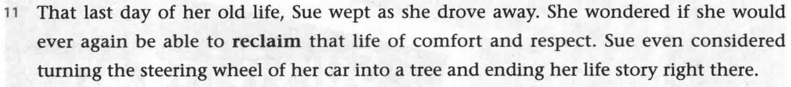

- **reclaim** 夺回

---

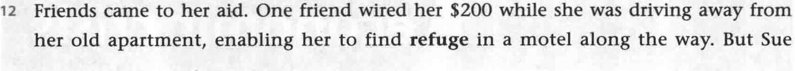

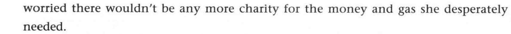

- desperately adv. 极度的；拼命的

---

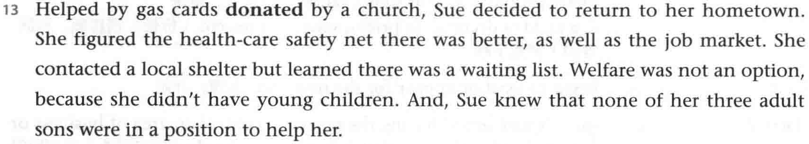

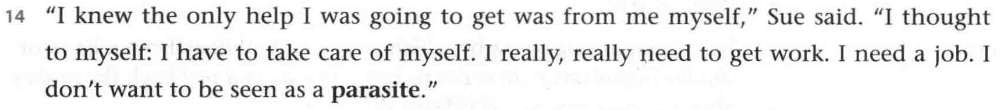

- **parasite** n. 寄生虫

---

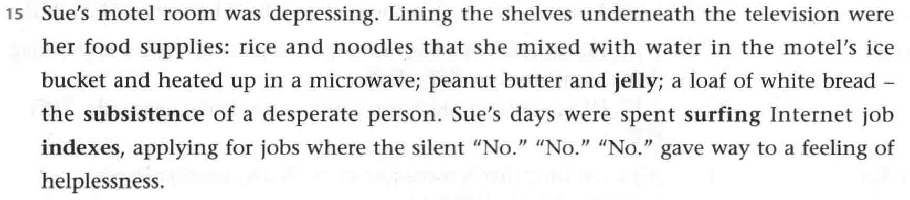

- peanut n. 花生
- **jelly** n. 果酱
- **subsistence** n. 生活；生计
- **surf** v. 上网；网上冲浪
- **index** n. 资料；索引；指数

---

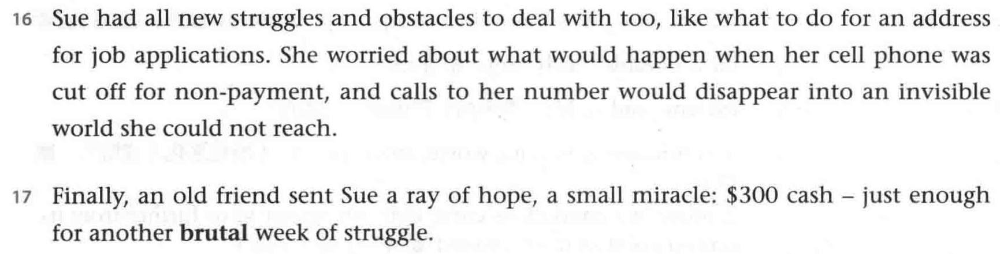

- struggles and obstacles 麻烦事
- 