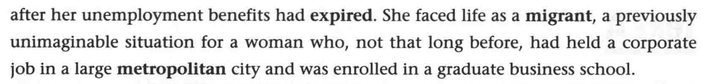

# B3U7

## Before class

## New words

## Section A

- **slump** n. 不景气，萧条
- **originate** v. 起源，发起  <kbd>同根词</kbd>origin n. 起源
- **regulatory** adj. 监管的
- **mortgage** n. 抵押贷款 v. 抵押
- **repay** v. 偿还
- **oversight** n. 监管，监督
- **subsidiary** n. 子公司
- **shareholder** n. 股东
- **sizable** adj. 巨大的
- **drastic** adj. 激烈的；厉害的；突然的
- **spiral** vi. 不断恶化 n. 螺旋；螺旋线 adj. 螺旋的

- **layoff** n. 裁员；解雇
- **termination** n. 结束，终止
- **rebound** n. 复兴，振兴；回弹

---

- **tenant** n. 房客；租户
- **eviction** n. 驱逐
- pack up 打包；收拾卷起
- fit into 塞进
- wound(wind) up ... 结果 ... [=end up]
- scrape together (勉强)凑足
- unemployment benefits 失业金
- **expire** vi. 失效，终止；到期
- **metropolitan** adj. 大城市的

---

- **likelihood** n. 几乎肯定的；极可能的
- exhaust 耗尽；使筋疲力尽