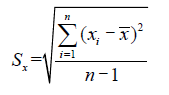
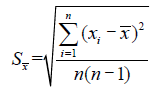
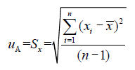
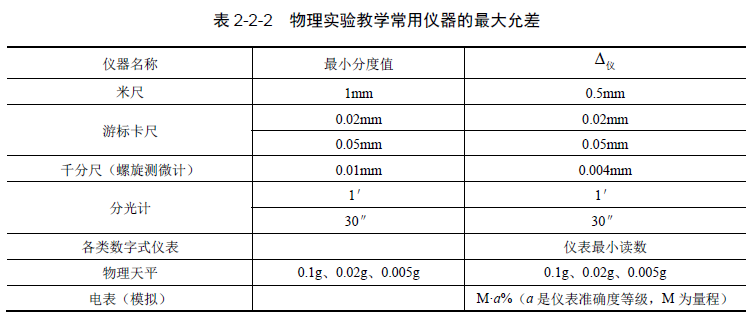

物理实验

# 数据处理-基础知识

## 四舍六入法

与四舍五入类似，规则如下

- 当最后一位为 4 及4以下时，舍去
- 当最后一位为 6 及6以上时，步入

特殊情况，当最后一位为 5 时，有以下规则

- 当 5 的后面无数字或为 0 时
  - 前一位为奇数，步入
  - 前一位为偶数，舍去
- 当 5 后面有非零数字时 (只要5后面存在有非0数字，如1.0005<u>001</u> )，则步入 

## 实验误差

#### 测量误差

若某物理量的真值为 $x$，其值为 $x_0$ 

**绝对误差**  $\delta=x-x_0$

**相对误差** $E = {\delta \over x_0} \times 100\%$

#### 误差分类

##### 系统误差 

> 通常反映在B类不确定度

是在相同条件下对同一物理量进行多次测量，误差的大小和符号保持恒定或按某一确
定的规律变化，这类误差称为系统误差。它的特征是具有确定性、规律性，增加测量次
数是不能减小或消除系统误差的。 

包括：**仪器误差、理论或方法误差、环境误差、个人误差**

##### 随机误差

> 通常反映在A类不确定度

指的是：在对同一物理量进行的多次重复测量中，大小和符号以无规律且不
可预知的方式变化的测量误差分量。其特点是具有随机性，是不可避免的。随机误差是
由实验中各种因素的波动引起的，如实验环境条件的波动、测量仪器指示值的波动、被
测量本身的不确定性，以及实验者在判断和估计读数时的随机性等。

## 标准偏差

#### 标准差 （理想）

$$
\sigma(x) = \lim_{n\to\infty}\sqrt{{1\over n}\sum^n_{i=1}(x_i-x_o)^2}
$$

#### 标准偏差 （实验常用）

我们把某一次测量值$x_i$ 和平均值 $\overline{x}$ 之差称为该次测量的残差，用方均根法对它们进
行统计，得到的结果称为测量列的标准偏差，记作$S_x$ ，即

上述公式只是计算某一次测量值($x$)的标准偏差，但实验更常见使用测量的算数平均值($\overline{x}$) **来计算平均值的标准偏差**

## 测量不确定度

#### A类不确定度($u_a$)

> A类不确定就是实验的标准偏差

实验中，为了方便，A 类不确定度可以简化为**标准偏差**值

#### B类不确定度($u_b$)

实验中，为了方便，简化约定B 类不确定度等于仪器误差$\Delta_仪$，即
$$
u_b = \Delta_仪
$$
**仪器误差可以由以下几种方法获得**

1）从仪器说明书或国家标准上查找，如最大允差。

2）根据仪器的级别计算。有的仪器说明书上没有给出仪器误差，但给出仪器的准
确度等级，可根据等级与仪器误差的函数关系计算出仪器误差，如指针式电表、电阻箱
的不确定度限值。

3）取最小分度值作为仪器误差。有些仪器根据其特点规定仪器误差取最小分度值，
如数字仪表。

4）根据具体情况合理选取仪器误差。有些测量不能按上面的方法选取仪器误差，
需要根据实际情况估计一个合理的误差限来作为仪器误差。例如，在拉伸法测弹性模量
实验中，要测量钢丝长度以及反射镜与标尺间的距离（约1m），由于装置的原因，很难
将被测物两端与钢卷尺的刻线对齐，所以测量结果的最大误差就会大于钢卷尺的仪器误
差。此时仪器误差就应该根据具体情况合理地选取。表2-2-2 给出物理实验教学常用仪
器的最大允差。

#### 合成不确定度($u$)

**多次测量的合成不确定度**

在相同条件下对待测量进行多次测量时，待测量的合成不确定度 $u$ 由A类不确定度$u_A$ 和B类不确定度$u_B$ 合成而得。其合成公式为
$$
u = \sqrt{u_A^2-u_B^2}
$$

## 有效数字

我们把测量结果中**可靠的几位数字**加上**可疑的一位数字**，称为测量结果的有效数字。