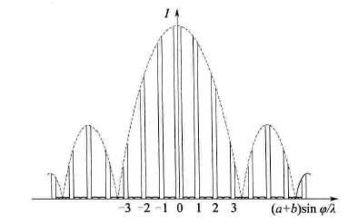
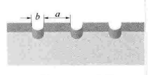

# 波动光学

## 光程

公式
$$
光程 = \sum nr
$$
其中 $r$ 为光线经过的路程，$n$ 为经过的介质的折射率

## 相干光

### 性质

### 获取方法

- 分波面法 （例子：双缝干涉）

- 分振幅法 （例子：薄膜干涉）

## 干涉

### 双缝干涉

#### 结论

明条纹距离中心公式
$$
x = ±k{D \over d} \lambda,\quad k =0,1,2,\dots
$$
暗条纹距离中心公式
$$
x = ±(2k-1){D \over d} {\lambda \over 2},\quad k =0,1,2,\dots
$$
两相邻明条纹或暗条纹的距离公式
$$
\Delta x= x_{k+1} - x_k = {D \over d}\lambda
$$

### 薄膜干涉

### 劈尖干涉

#### 半波损失

#### 劈尖干涉(等厚干涉)

特点：

- 夹角越小，条纹越宽，条纹外移
- 夹角越大，条纹越窄，条纹内移

#### 牛顿环

## 衍射

### 单缝衍射

中央明条纹线宽度
$$
\Delta x_0 = 2 {\lambda \over a}f
$$
其他明条纹线宽度
$$
\Delta x= {\lambda \over a}f
$$

### 光栅衍射

#### 光栅常数

$$
光栅常数：a+b
$$

其中 a 代表光栅透光部分总宽度、b 代表光栅不透光部分总宽度

#### 光栅公式

光栅衍射的明条纹的位置应该满足以下公式
$$
(a+b)\sin \phi = k\lambda, \quad k=0,±1,±2,\dots
$$
其中 $k$ 为明条纹级数，通常称为**主极大条纹**

#### 缺级

若某一衍射角 $\phi$ 满足**光栅方程**的同时，也满足单缝衍射的**暗纹条件**，即
$$
(a+b)\sin \phi = k\lambda, \quad k=0,1,2,\dots\\
a\sin\phi = ±k'\lambda, \quad k=1,2,3,\dots\\
$$

虽然满足光栅公式，但由于衍射原因，某些地方的主极大不再显示，这种现象就称为**缺级**

缺级的级数满足公式
$$
k = k'{a+b\over a}
$$
这个式子也称为 **缺级条件**

