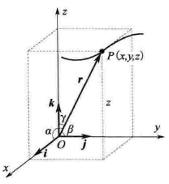
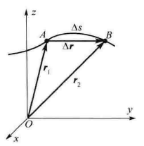
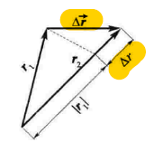

## 位矢与位移

### 位置矢量

在空间坐标系中，可以用矢量 $\vec {OP} = \vec r$ 来描述 $P$ 点的位置，矢量 $\vec r$ 就是 $P$ 点的**位置矢量**，简称**位矢**

相应的，坐标 $x,y,z$ 也就是位矢 $\vec r$ 在坐标轴上的三个分量

$\vec r$ 可以表示为
$$
\vec r = x\vec i+y\vec j+z\vec k
$$
$\vec r$ 的大小为
$$
|\vec r| = r =\sqrt{x^2 + y^2 + z^2}
$$
$\vec r$ 的方向余弦为
$$
\cos \alpha = {x\over r} \quad \cos\beta = {y\over r} \quad \cos\gamma = {z\over r}
$$

### 位移

空间中有一点 $A$ ，它经过时间 $t+\Delta t$ 后运动到位置 $B$ ，此时 $A,B$ 两点的位矢分别为 $\vec r_1,\vec r_2$ 

其中**位移**就是 $\Delta \vec r$
$$
\Delta\vec r = \vec r_2 -\vec r_1
$$
**位移的模**表示为
$$
|\Delta\vec r| = |\vec r_2 -\vec r_1|
$$

> **注意：**位移的模只能表示为 $|\Delta\vec r|$，而不能表示为 $|\Delta r|$ (r上不带箭头)，因为 $|\Delta r|$通常用来表示两个位矢的模的增量，即 $|\Delta r| = |\vec r_2| - |\vec r_1|$
>
> 

## 运动方程&轨迹方程

### 运动方程

质点在空间坐标系中的运动方程表示为

运动方程是确定质点**在空间中的位置**与**时间**的关系
$$
\vec r(t) = x(t)\vec i + y(t)\vec j + z(t)\vec k
$$

### 轨迹方程

质点在空间中的运动路径叫**轨道（轨迹）**

通过运动方程消去参数 $t$ ，得到的方程称为**轨迹方程**

轨迹方程是描述质点**运动路径形状**的方程

轨迹方程与运动方程区别在于，运动方程含有时间变量 $t$，而轨迹方程没有

## 速度

### 平均速度

若在 $t$ 到 $t+\Delta t$ 时刻内，质点位移为 $\Delta\vec r$，**平均速度 **$\vec v$ 就**是位移变化量 **$\Delta\vec r$ 与**经历时间** $\Delta t$ 的比值
$$
\overline{ \vec {v}} = {\Delta\vec r \over \Delta t}
$$

> 平均速度与平均速率：**平均速率**是指质点运动的**路程**与时间的比值 $\Delta s\over \Delta t$，而**平均速度**是**位移**与时间的比值 $\Delta \vec r\over \Delta t$，两者不一样

### 瞬时速度

顺时速度则是当经历时间趋近于零时的**平均速度**，可以用位移对时间的一阶导数表示
$$
\vec v = {d\vec r \over dt}
$$

## 加速度

加速度就是**位矢对时间的的二阶导数**，或者是**速度对时间的一阶导数**
$$
\vec a = {d^2\vec r\over dt^2} \quad
\vec a = {d\vec v\over dt}
$$

## 圆周运动

##### 描述圆周运动的角量

| 角量     | 公式                                                 |
| -------- | ---------------------------------------------------- |
| 角位置   | $\theta = \theta(t)$                                 |
| 角速度   | $\omega = {d\theta\over dt}$                         |
| 角加速度 | $\beta = {d\omega\over dt} = {d^2\theta \over dt^2}$ |

##### 角量与线量之间的关系

线速度与角速度转换：

$$
v={ds\over dt} = {rd\theta \over dt} = r\omega
$$

**切向加速度：**
$$
a_\tau = {dv\over dt} = {rd\omega \over dt} = r\beta
$$

**法向加速度：**
$$
a_n = {v^2\over r} = \omega^2r
$$
