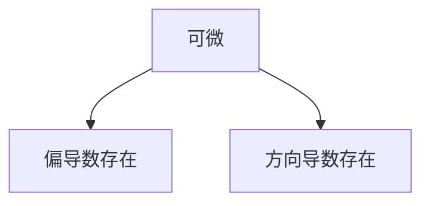

第九章

# 方向导数与梯度

## 方向导数

方向导数计算公式：
$$
{\part f \over \part l} = {\part f\over \part x}\cos\alpha + {\part f\over\part y}\cos\beta + {\part f\over\part z}\cos\gamma
$$

其中 $\vec e_l (\cos\alpha,\cos\beta,\cos\gamma)$ 是与向量 $\vec l$ 同方向的向量，计算方法为：
$$
\vec l(x,y,z) \quad \vec e_l = ({x\over \sqrt{x^2+y^2+z^2}},{y\over \sqrt{x^2+y^2+z^2}},{z\over \sqrt{x^2+y^2+z^2}}) = (\cos\alpha,\cos\beta,\cos\gamma)
$$

特殊情况

- 当 $\alpha = 0$ 时，${\part f\over\part l} = {\part f\over\part x}$
- 当 $\beta = 0$ 时，${\part f\over\part l} = {\part f\over\part y}$

方向导数与偏导数、可微的关系

由可微可以向下推出偏导数存在和方向导数存在，而不能向上推出可微；偏导数存在于方向导数存在之间不存在关系。

## 梯度

梯度是一个向量，$f(x,y)$ 在点 $P_0(x_0,y_0)$ 的梯度表示为 $gradf(x_0,y_0)$ 

梯度计算公式
$$
gradf(x_0,y_0,z_0) = f_x\vec i + f_y\vec j + f_z\vec k
$$

方向导数与梯度的关系
$$
{\part f\over \part l}|_{(x_0,y_0)} = f_x(x_0,y_0)\cos\alpha + f_y(x_0,y_0)\cos\beta \\ = gradf(x_0,y_0)\cdot \vec e_l = |gradf(x_0,y_0)|\cos\theta
$$
其中角 $\theta$ 是向量 $\vec l$ 与 $\vec e_l$ 的夹角

梯度求模即为方向导数的最大值