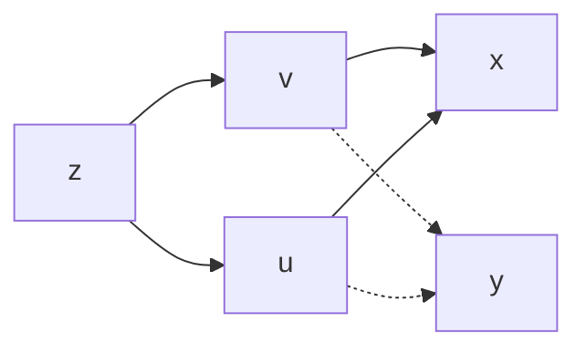

第九章 第四节

# 多元复合函数求导法则

#### 一个自变量

----

若 $z=f(u,v,w)$ 是由 $u=u(t),v=v(t),w=w(t)$ 复合而成的，$u=u(t),v=v(t),w=w(t)$ 在点 $t$ 可导，$z=f(u,v,w)$ 在点 $(u,v,w)$处具有连续的一阶偏导数。

计算公式为：
$$
{dz \over dt} = {∂z \over ∂u}\cdot{du\over dt} + {∂z\over ∂v}\cdot{dv\over dt} + {∂z\over ∂w}\cdot{dw \over dt}
$$
其中 $dz \over dt$ 称为**全导数**

#### 多个自变量

---

**对称型：**

如果 $u=\phi(x,y), v=\psi(x,y)$ 都在对应点 $(x,y)$ 具有对 $x ,y$ 的偏导数，且函数 $z=f(u,v)$ 在对应点 $(u,v)$ 具有连续的偏导数，则复合函数 $f[\phi(x,y),\psi(x,y)]$ 在对应点的两个偏导数存在

计算公式为：
$$
{∂z\over ∂x} = {∂z\over ∂u}\cdot{∂u\over ∂x} + {∂z\over ∂v}\cdot{∂v\over ∂x}
$$

$$
{∂z\over ∂y} = {∂z\over ∂u}\cdot{∂u\over ∂y} + {∂z\over ∂v}\cdot{∂v\over ∂y}
$$

$$
dz = {∂z\over ∂x}dx + {∂z\over ∂y}dy
$$

**非对称型：**

如果 $u=\phi(x,y)$ 在对应点 $(x,y)$ 具有对 $x ,y$ 的偏导数, $v=\psi(y)$ 在点 $y$ 可导，且函数 $z=f(u,v)$ 在对应点 $(u,v)$ 具有连续的偏导数，则复合函数 $f[\phi(x,y),\psi(y)]$ 在对应点的两个偏导数存在

计算公式为：
$$
{∂z\over ∂x} = {∂z\over ∂u}\cdot{∂u\over ∂x}
$$

$$
{∂z\over ∂y} = {∂z\over ∂u}\cdot{∂u\over ∂y} + {∂z\over ∂v}\cdot{dv\over dy}
$$

$$
dz = {∂z\over ∂x}dx + {∂z\over ∂y}dy
$$

由于 $v=\psi(y)$ 是一元函数，所以把 ${∂v\over ∂y}$ 相应的换成 ${dv\over dy}$

#### 链式图

---
$$
{∂z\over ∂x} = {∂z\over ∂u}\cdot{∂u\over ∂x} + {∂z\over ∂v}\cdot{∂v\over ∂x} \tag{1}
$$

1. 偏导数 ${∂z\over ∂x}$ 公式中的项数，等于链式图中从自变量 $x$ 到达因变量 $z$ 的路径条数

2. 公式 (1) 右边每一个偏导数乘积因子都与图中一条路径与之对应

---

**既是自变量又是中间变量的情况：**

> 巧记：沿线相乘，分线相加

#### 全微分的不变性

---

无论函数中存在多少个中间变量，最终所求的因变量与自变量的关系都不变，关系如下（z为因变量；x，y为自变量）
$$
dz = {∂z\over ∂x}dx + {∂z\over ∂y}dy
$$