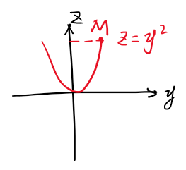
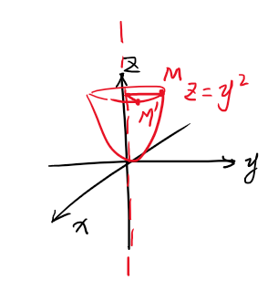
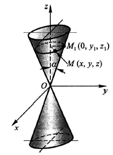
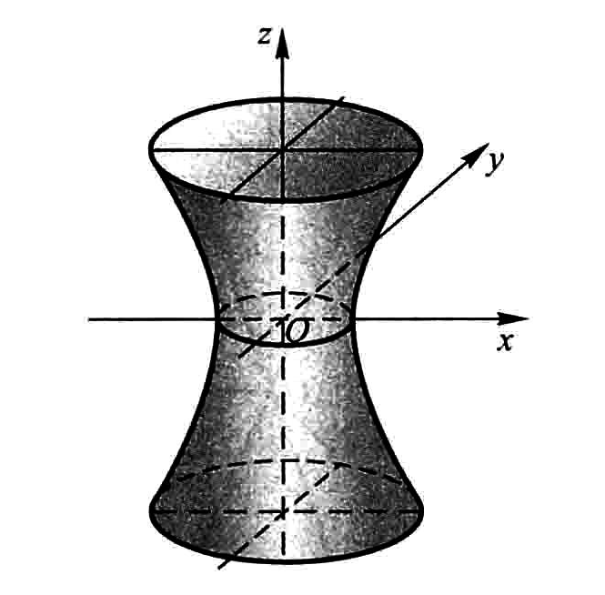
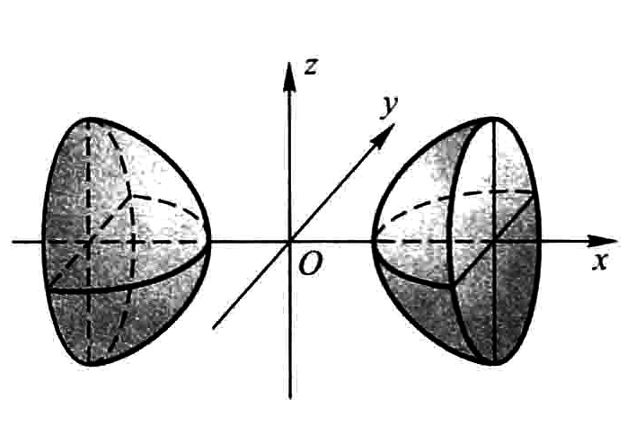
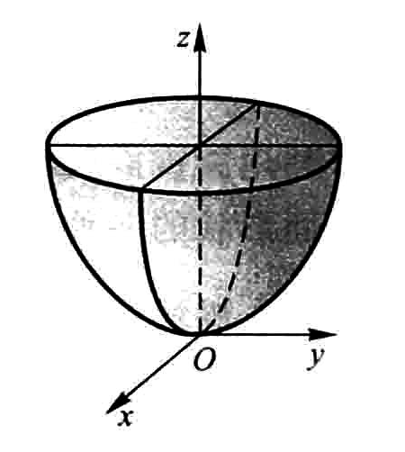
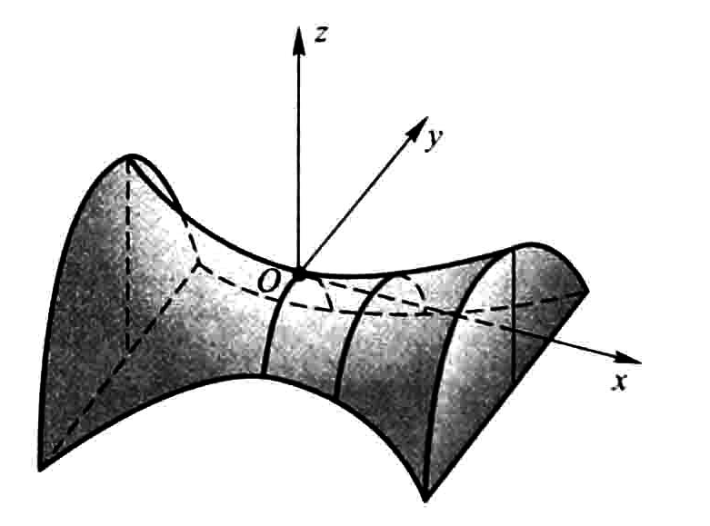

第八章 第五节

# 曲面及其方程

## 球面

标准方程
$$
(x-x_0)^2+(y-y_0)^2+(z-z_0)^2=R^2
$$

一般方程
$$
Ax^2 + Ay^2 + Az^2 + Ex + Dy + Fz + G = 0
$$
**球面一般方程特点：缺xy,yz,zx项，平方项系数相同** 

## 旋转曲面

由原一平面上的曲线绕某一轴旋转一周得到的曲面

> 绕谁谁不变

### 如何由平面方程求得曲面方程

如在平面 $yOz$ 面上有一曲线 $z = y^2$，令其绕 $x$ 轴旋转一周，得到的曲面方程为 $z = y^2 + x^2$

如图表示方程 $z = y^2$ 

当曲面上一点 $M$ 稍向顺时针转动一点，$M$ 到 $z$  轴的距离就变成了 $\sqrt{x^2+y^2}$ ，由此可知，原来方程右边的 $y^2$ 里的 $y$ 应该替换为 $\sqrt{x^2+y^2}$

所以原方程就变为了 $z = (\sqrt{y^2 + x^2})^2 =  y^2 + x^2$

**注意：**等式的正负号

> 绕 $x$ 轴 $x$ 不变，把 $y_0 = \sqrt{y^2+z^2}$ 带入原方程即可，其他轴同理

### 常见旋转曲面

#### 圆锥面

一般公式：
$$
z^2 = a^2(x^2+y^2)\ 或\ z=a \sqrt{x^2 + y^2}
$$

**正圆锥面**公式：（取消系数a）
$$
\sqrt{x^2 + y^2} = z\ 或 \ x^2 + y^2 = z^2
$$

#### 旋转抛物面（碗旋面）

由平面上抛物线绕定轴选择而成

公式：
$$
z = p(x^2+y^2)
$$

正旋转抛物面：
$$
z = x^2+y^2
$$

> 高为1的旋转抛物面体积为 $\pi\over 2$

#### 旋转单、双叶双曲面

**旋转单叶双曲**面公式：
$$
{{x^2 + y^2} \over a^2} - {z^2 \over c^2} = 1
$$

**旋转双叶双曲**面公式：
$$
{x^2 \over a^2} - {{y^2 + z^2 }\over c^2} = 1
$$

## 柱面

> 在空间直角坐标系中只包含两个元素的方程 (去除的元素为母线所平行的轴)
> 平面的二次曲线方程放入空间坐标系中都表示为对应的柱面
>
> 平行哪个轴，那个轴为0

### 常见柱面

#### 圆柱面

公式：(母线平行 $z$ 轴，$z=0$ 其他轴同理)
$$
x^2 +y^2 = a^2
$$

#### 抛物柱面

$$
y^2 = 2px
$$

#### 双曲柱面

$$
{x^2\over a^2} - {y^2\over b^2} = 1
$$

## 二次曲面

> 把三元二次方程 $F(x,y,z)=0$ 所表示的曲面成为**二次曲面**

由于二次曲面无法直接得出图像，需要借助**截面法**或者**伸缩法**间接求出曲面的图像

### 伸缩法

在相应的旋转曲面方程上向 $y$ 轴伸缩 $b \over a$ 倍，可得到下列曲面

#### 椭圆锥面

$$
{x^2\over a^2} + {y^2\over b^2} = z^2
$$

#### 椭球面

$$
{x^2\over a^2} + {y^2\over b^2} + {z^2\over c^2} = 1
$$

#### 单叶双曲面

> 为什么叫**"单叶双曲面"**? 由于伸缩变换后，为了区分**"旋转"单叶双曲面**，名称内剔除了**"旋转"**二字。

$$
{x^2\over a^2} + {y^2\over b^2} - {z^2\over c^2} = 1
$$

#### 双叶双曲面

$$
{x^2\over a^2} - {y^2\over b^2} - {z^2\over c^2} = 1
$$

#### 椭圆抛物面

公式：
$$
{x^2 \over a^2} + {y^2 \over b^2} = z
$$

### 截面法

#### 双曲抛物面（马鞍面）

公式：
$$
{x^2 \over a^2} - {y^2 \over b^2} = z
$$

## 根据方程特点判断曲面类型

- 如果方程中 $x,y,z$ 的次数相同，为**锥面**
  - 左边不为含参数a,b的分式，为**圆锥面**： $x^2 + y^2 = z^2$
  - 左边为分式，为**椭圆锥面**：${x^2\over a^2} + {y^2\over b^2} = z^2$

- 如果方程中 $z$ 是一次，$x,y$ 为二次，为**抛物面** 
  - 左边不为含参数a,b的分式，为**旋转抛物面**：$x^2+y^2= z$
  - 左边为分式，为**椭圆抛物面**：${x^2 \over a^2} + {y^2 \over b^2} = z$

- 如果方程左边为分式，右边 = 1

  - 且只有两个参数 $a,b$，为**旋转双曲面**：${{x^2 + y^2} \over a^2} - {z^2 \over c^2} = 1$，${x^2 \over a^2} - {{y^2 + z^2 }\over c^2} = 1$
    - 通过**绕谁谁不变**原则判断是单叶还是双叶
  - 且有三个参数 $a,b,c$，为二次曲面
    - 如果方程都是正号，为**椭球面**：${x^2\over a^2} + {y^2\over b^2} + {z^2\over c^2} = 1$
    - 一正一负，为**单叶双曲面**：${x^2\over a^2} + {y^2\over b^2} - {z^2\over c^2} = 1$
    - 都是负号，为**双叶双曲面**：${x^2\over a^2} - {y^2\over b^2} - {z^2\over c^2} = 1$

  

