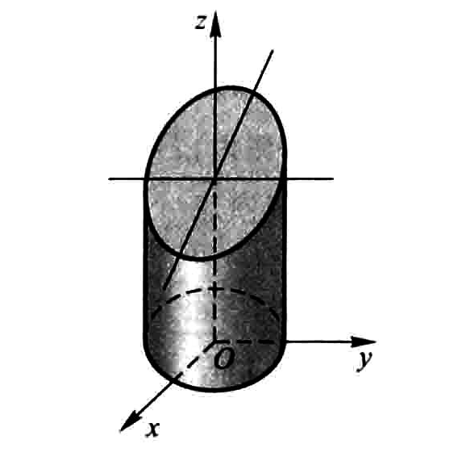
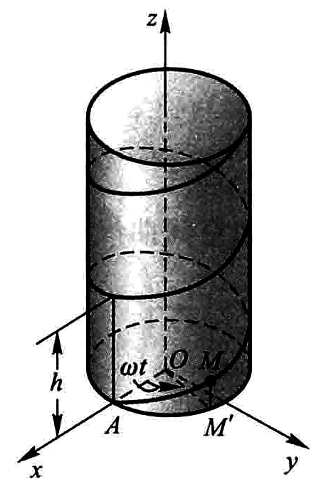

第八章 第六节

# 空间曲线及其方程

#### 一般方程

---

空间曲线的一般方程是由两个空间曲面方程所确定的，如
$$
\left\{
\begin{aligned}
x^2 + y^2 & = 1 \\
2x + 3z & = 6 \\
\end{aligned}
\right.
$$
表示一个母线平行于 $z$ 轴，准线为 $xOy$ 上 $O$ 为圆心半径为1的一个圆柱面与一个垂直平面 $xOz$ 的平面的交线，如图所示

#### 参数方程

---

把空间曲线方程化为参数方程有
$$
\left\{
\begin{aligned}
x &= x(t), \\
y &= y(t), \\
z &= z(z).
\end{aligned}
\right.
$$

#### 螺旋线

---

螺旋线是由空间一点 $M$ 在圆柱面 $x^2+y^2=a^2$ 上以角速度  $\omega$ 绕 $z$ 轴旋转，同时又以线速度 $v$ 沿平行于 $z$ 轴的正方向上升（$\omega,v$ 都是常数），那么点 $M$ 的运动轨迹构成的图形叫做**螺旋线**， 如图所示为螺旋线

螺旋线的参数方程为：
$$
\left\{
\begin{aligned}
x &= a\cos{\omega t}, \\
y &= a\sin{\omega t}, \\
z &= vt.
\end{aligned}
\right.
$$
或者以 $\theta$ 为参数 ($\theta ={ \omega t}$)，这里 $b = {v \over w}$，而参数为 $\theta$
$$
\left\{
\begin{aligned}
x &= a\cos{\theta}, \\
y &= a\sin{\theta}, \\
z &= b\theta.
\end{aligned}
\right.
$$

#### 在坐标面上的投影

---

> 先消除元素，再合并元素=0

由空间曲线的一般方程 $ \left\{ \begin{aligned} F(x,y,z) &= 0, \\ G(x,y,z) &= 0\end{aligned}\right.$ 消除其中的一个元素 $z$ 得到方程 $ H(x,y) =0 $，此时方程 $H$ 表示一个柱面，又由于方程 $H$ 是由原方程消除元素而得来的，所以该曲线一定在这个柱面上，现在只要把 $z = 0$ 与方程 $H$ 合并就可以得到该曲线在平面 $xOy$ 上的投影方程，即
$$
\left\{\begin{aligned}
H(x,y) &= 0, \\
z &= 0
\end{aligned}\right.
$$
所表示的曲线就是空间曲线在平面 $xOy$ 上的投影.

