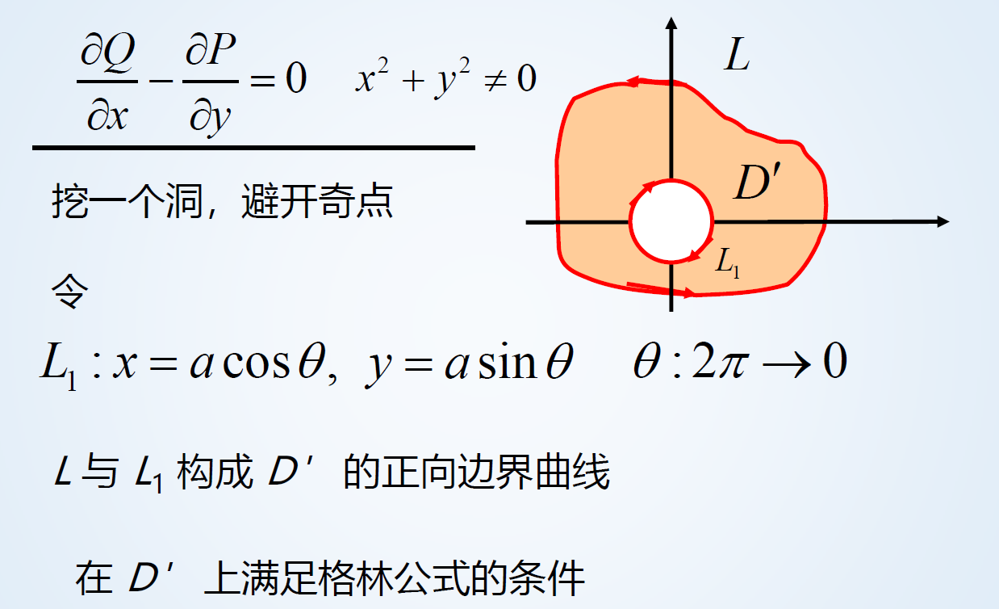

第十一章

# 格林公式

## 单连通与复连通区域

若区域 $D$ 中不含有“洞”（包括“点洞”），则称为单连通区域；若含有“洞”，则称为复连通区域。

如以原点为圆心，半径为 $R$ 的元是单连通区域；以原点为圆心，半径为 $2\leq R \leq 4$ 为复连通区域。

## 边界曲线的正向

按照某一方向在区域 $D$ 边界上做环行运动时，称环行方向的左侧为边界曲线的正向。

## 格林公式

$$
\iint \limits_{D} ({\part Q \over \part x} - {\part P \over \part y})dxdy = \oint_L Pdx + Qdy
$$

**适用条件：**

- $L$ 是**封闭**的
- 是 $L$ 的**正向**曲线边界
- $P,Q$ 具有**连续一阶偏导数**

**注意事项：**

- 必须同时满足上述3个条件才能使用
- 如果 $L$ 为负向，可以先进行转变

$$
\oint_{L顺}Pdx + Qdy = -\oint_{L逆} Pdx + Qdy
$$

- 如果 $L$ 不封闭，则考虑添加辅助线将其变成封闭区域，即 $L + L_1 + L_2 + L_3 + \dots + L_n$ 是封闭区域

$$
\oint_L = \oint_{L+L'} - \oint_{L'}
$$

- 当 ${\part P \over \part y}-{\part Q \over \part x} = 0$ 时
  - 如果区域内没有奇点（使得 $P,Q,{\part P \over \part y},{\part Q \over \part x}$ 不能连续的点），则 $\oint_L = \iint \limits_{D}0dxdy = 0$
  - 如果区域内有奇点，应当先添加辅助线 $L'$ “挖去” 再应用公式
  - 
- 应用格林公式需要先检验 $P,Q,{\part P \over \part y},{\part Q \over \part x}$ 的连续性
- 由格林公式可以得到利用曲线积分求面积的新方法

$$
A = {1\over2}\oint_L xdy - ydx
$$

## 平面上曲线积分与路径无关的条件

有如下定理：设区域 $G$ 是一个**连通区域** ，若函数 $P(x,y)$ 与 $Q(x,y)$ 在 $G$ 内**具有一阶连续偏导数**，则曲线积分 $\int_L Pdx + Qdy$ 在 $G$ 内与路径无关的充要条件是
$$
{\part P\over\part y} = {\part Q\over \part x}
$$
且在 $G$ 内恒成立

## 二元函数全微分求积

