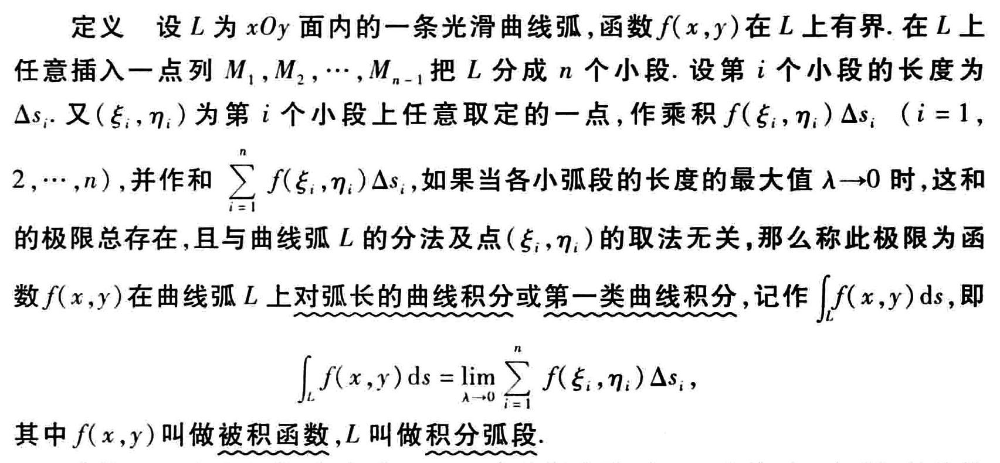
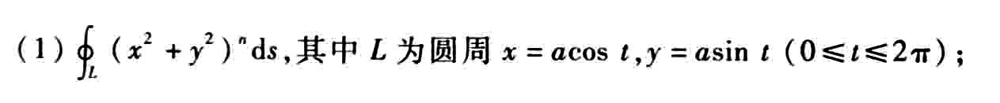
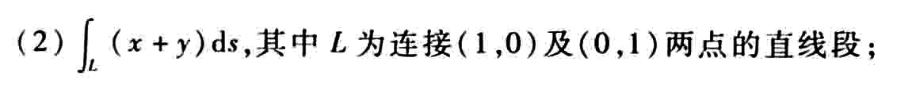

第十一章

# 第一类曲线积分

## 定义

## 计算方法

计算曲线积分
$$
\int_L f(x,y)ds
$$

**第一步：**把积分弧段 $L$ 的一般方程转化为参数方程，即
$$
L = \left\{\begin{align}x &=\phi(t), \\ y &= \psi(t) \end{align}\right. \quad (\alpha \leq t\leq \beta)
$$
**第二步：**带入公式
$$
\int_L f(x,y)ds = \int_\alpha^\beta f[\phi(t),\psi(t)]\sqrt{\phi'^{2}(t) + \psi'^{2}(t)} dt\quad (\alpha < \beta)
$$

其中：

- $\alpha,\beta$ 是参数 $t$ 的范围
- $f[\phi(t),\psi(t)]$ 是将曲线函数带入被积函数的意思

**特殊情况：**

(1) 如果 $L$ 的形式为 $y=y(x)$ 或者 $x=x(y)$，化参数方程时应变成 (以 $y=y(x)$ 为例)
$$
L = \left\{\begin{align}x &=x, \\ y &= y(x) \end{align}\right. \quad (\alpha \leq x\leq \beta)
$$
并且得到
$$
\int_L f(x,y)ds = \int_\alpha^\beta f[x,y(x)]\sqrt{1 + y'^{2}(x)} dx\quad (\alpha < \beta)
$$

(2) 如果 $L$ 由极坐标方程 $\rho = \rho(\theta)$ 给出，则
$$
\int_L f(x,y)ds = \int_\alpha^\beta f[\rho(\theta)\cos\theta,\rho(\theta)\sin\theta]\sqrt{\rho^{2}(\theta) + \rho'^{2}(\theta)} d\theta \quad (\alpha < \beta)
$$

## 性质 & 运算简化

- 当被函数为 1 时，积分结果为曲线 $L$ 的周长
- 被积函数必满足曲线方程 $L$
- 利用积分对称性

## 例题

1. 利用被积函数必满足 $L$ 曲线的关系

