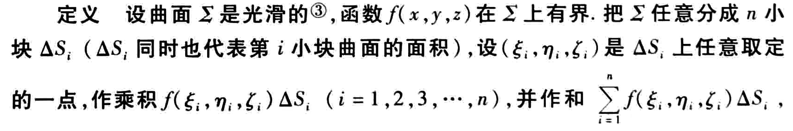

第十一章

## 第一类曲面积分

## 定义

## 计算方法

积分曲面共有3种情况，即分别由方程 $z = f(x,y) ， y = f(x,z) ， x = f(y,z)$ 给出，一下只以 $z = f(x,y)$ 情况为例，其余情况求解方法类似。

**第一步：** 做出 $\Sigma$ 的图像，并写出 $\Sigma$ 的显函数方程 $z = f(x,y)$

**第二步：** 求出 $\Sigma$ 在 $xOy$ 面上的投影区域 $D_{xy}$ 的方程

**第三步：** 计算面积元素 $dS = \sqrt{1 +z^2_x+z^2_y}dxdy$

**第四步：** 计算二重积分
$$
\iint \limits_\Sigma f(x,y,z)dS = \iint\limits_Df[x,y,z(x,y)]\sqrt{1 +z^2_x+z^2_y}dxdy
$$

## 注意事项

- 利用关于坐标对称性简化

- 轮换对称性

  

  该例中由于 $\Sigma$ 具有轮换对称性，所以有把被积函数中的元素 $x$ 化为其他元素( $y$ 或 $z$ )后 积分结果不变的性质

  因此可以用 
  $$
  \oiint\limits_\Sigma x^2 dS = {1\over 3}\oiint\limits_\Sigma (x^2+y^2+z^2)dS= {1\over 3}\oiint\limits_\Sigma a^2dS
  $$
  

   快速计算出曲面积分结果

  

- 被积函数 $f(x,y,z)$ 满足积分曲面 $\Sigma$ 的方程

- 当被积函数为1时，所求结果为 $\Sigma$ 的面积

