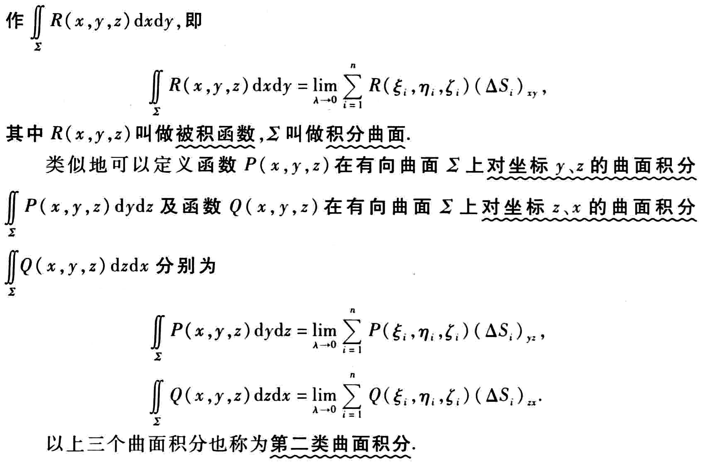

第十一章

# 第二类曲面积分

## 单侧曲面与双侧曲面

通常来说我们所见的曲面都是双侧曲面

单侧曲面特例：莫比乌斯环，莫比乌斯瓶

## 有向曲面

**有向曲面侧的规定：**‘

侧的规定是由法向量的方向余弦规定的，规则如下表

当取定侧向以后，实际上判断是某侧的问题就可以通过相应角是锐角还是钝角来得出

**有向曲面的投影：**

这里的投影比普通的投影多了方向的概念，即按照上述侧的规定给投影面积**添加正负号**

## 定义

## 计算方法

以计算方程由 $z(x,y)$ 给出的为例
$$
\iint\limits_\Sigma R(x,y,z)dxdy
$$
**第一步：** 做出曲线 $\Sigma$ 的图像，并明确取向

**第二步：** 明确投影面积微元 $\Delta\sigma$ 的符号

**第三步：** 根据公式将曲面积分转换为二重积分
$$
\iint\limits_\Sigma R(x,y,z)dxdy = \iint\limits_{D_{xy}} R[x,y,z(x,y)]dxdy
$$
类似的，曲面若方程由 $x(y,z)$ 或 $y(x,z)$ 给出，则有
$$
\iint\limits_\Sigma P(x,y,z)dydz = \iint\limits_{D_{yz}} P[x(y,z),y,z]dydz
$$

$$
\iint\limits_\Sigma Q(x,y,z)dzdx = \iint\limits_{D_{zx}} Q[x,y(z,x),z]dzdx
$$

## 两类曲面积分关系

曲面 $\Sigma$ 的法向量的方向余弦可化为
$$
\cos\alpha = {-z_x \over\sqrt{1 + z^2_x + z^2_y}} \quad \cos\beta = {-z_y \over\sqrt{1 + z^2_x + z^2_y}} \quad \cos\gamma = {1 \over\sqrt{1 + z^2_x + z^2_y}}
$$

两类曲面积分转化公式为
$$
\iint\limits_\Sigma P(x,y,z)dxdy = \iint\limits_\Sigma P(x,y,z)\cos\alpha dS
$$

$$
\iint\limits_\Sigma Q(x,y,z)dxdy = \iint\limits_\Sigma Q(x,y,z)\cos\beta dS
$$

$$
\iint\limits_\Sigma R(x,y,z)dxdy = \iint\limits_\Sigma R(x,y,z)\cos\gamma dS
$$

合并上述3个公式有
$$
\iint\limits_\Sigma Pdydz + Qdzdx + Rdxdy = \iint\limits_\Sigma (P\cos\alpha + Q\cos\beta + R\cos\gamma)dS
$$

## 性质

- 可加性

  如果曲面 $\Sigma$ 被拆分为 $\Sigma_1,\Sigma_2$ 则有
  $$
  \iint \limits_\Sigma = \iint \limits_{\Sigma_1} + \iint \limits_{\Sigma_2}
  $$
  
- 反向性
  $$
  \iint \limits_{\Sigma-} = - \iint \limits_{\Sigma}
  $$
  