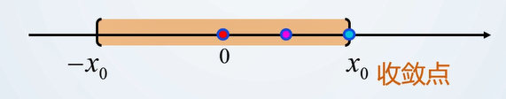

第十二章

# 幂级数

## 函数级数

级数的每一项都是关于 $x$ 的函数，就叫这个级数为**函数项级数**
$$
\sum_{n=1}^{\infty} u_n(x) =  u_1(x) +  u_2(x) +  u_3(x) + \dots +  u_n(x) + \dots
$$
其**部分和**也是一个**函数** $S_n(x)$

**收敛点：** 把 $x_0$ 带入函数 $u_n(x)$ 中，若使得常数级数 $\sum_{n=1}^{\infty} u_n(x_0)$ **收敛**，则称该点为收敛点

**发散点：** 把 $x_0$ 带入函数 $u_n(x)$ 中，若使得常数级数 $\sum_{n=1}^{\infty} u_n(x_0)$ **发散**，则称该点为发散点

**收敛域： **所有**收敛点的集合**叫做函数级数的**收敛域** $D$

**和函数：** 对函数级数的部分和 $s_n(x)$ 求极限 $\lim_{n \to \infty} s_n(x) = s(x)$，其中 $s(x)$ 称为**和函数**

和函数即为级数各项的和 $s(x) = \sum_{n=1}^{\infty} u_n(x)\quad x \in D$，要注意的是，只有当 $x$ 属于收敛域范围内等式才成立

这将是一个非常重要的性质，即**可以用一个函数来表示一个级数**

**余项：**与常数级数相同，$r_n(x) = s(x) - s_n(x)$

## 幂级数概念

#### 幂级数

幂级数的**标准式**与**一般式**如下表达式

$$
\sum_{n=0}^{\infty} a_nx^n = a_0 + a_1x + a_2x^2 + \dots + a_nx^n + \dots \\ \sum_{n=0}^{\infty} a_n(x-x_0)^n = a_0 + a_1(x-x_0) + a_2(x-x_0)^2 + \dots + a_n(x-x_0)^n + \dots
$$

通过 $t = x - x_0$ 可以将一般式转化为标准式

如果表达式为 $\sum_{n=0}^{\infty} ax^n$ 时，$a$ 不随 $n$ 变化而变化，则变成了等比级数

#### 当然收敛点

当幂级数中 $x=0$ 时，总有 $\sum_{n=0}^{\infty} a_n0^n = a_n$，所以称该点为**当然收敛点**

**注意：**只能用于标准式

## Abel定理

#### 定理概述

**定理1：**设幂函数 $\sum_{n=0}^{\infty} a_nx^n$ 在点 $x_0\neq0$ 处收敛，则对任何点 $x$ ，$|x| < |x_0|$ 都有 $\sum_{n=0}^{\infty} a_nx^n$ 绝对收敛

简单来说就是 **比收敛点更接近原点的点也是收敛点**

**定理2：** 设幂函数 $\sum_{n=0}^{\infty} a_nx^n$ 在点 $x_0\neq0$ 处发散，则对任何点 $x$ ，$|x| > |x_0|$ 都有 $\sum_{n=0}^{\infty} a_nx^n$ 发散

简单来说就是 **比发散点更远离原点的点也是发散点**

*定理证明*

#### 收敛半径

**定义**

Abel 定理，在收敛域 $D$ 上总能找到一个点 $R$ 使得

- 当 $|x|<R$，$\sum_{n=0}^{\infty} a_nx^n$ 绝对收敛
- 当 $|x|> R$，$\sum_{n=0}^{\infty} a_nx^n$ 发散
- 当 $|x| = R$，$\sum_{n=0}^{\infty} a_nx^n$ 可能发散可能收敛

由第三总情况可知，收敛域存在4总边界情况，分别为

$(-R,R) \quad [-R,R) \quad (-R,R] \quad [-R,R]$

**绝对收敛区间：** 当在点 $|R|$ 处的两个点都不收敛，则称区间 $(-R,R)$ ，也就是第一种情况，为**绝对收敛区间**

**收敛半径(R)求法**

利用比值判别法

设 $\lim_{n \to \infty}{|a_{n+1}|\over|a_n|} = \rho$，则

- 当 $0 < \rho < +\infty$ 时，$R = {1\over\rho}$
- 当 $\rho = 0 $ 时，$R = +\infty$ (处处收敛)
- 当 $\rho = +\infty$ 时，$R = 0$ (当然收敛点)

根值判别法 记住加绝对值

## 求幂级数收敛域步骤

1. 求幂级数的收敛区间 $(-R,R)$
2. 把边界点 $-R$ 与 $R$ 回代级数，讨论收敛区间 $(-R,R)$ 两个端点的敛散性
3. 从而确定区间的开合性，求得幂级数收敛域

常见情况 

- 当幂级数为 $\sum_{n=0}^{\infty} a_nx^{2n}$ 的情况时，缺奇次幂，可以使用变量代换，使$t = x^2$，最终求得 $R$ 时，再把 $x^2$ 回代即可

  对于缺偶次幂结论相同

  **一般结论：**

  当幂级数为 $\sum_{n=0}^{\infty} a_nx^{mn}$ 情况时，$R = {1\over \sqrt[m]{\rho}}$

  当幂级数为 $\sum_{n=0}^{\infty} a_nx^{2n}$ 或者 $\sum_{n=0}^{\infty} a_nx^{2n\pm1}$ 时，$R = {1\over \sqrt{\rho}}$

- 

## 幂级数运算法则

现有两个幂级数 $s(x) = \sum_{n=0}^{\infty} a_nx^n$ 与 $\sigma(x) = \sum_{n=0}^{\infty} b_nx^n$

幂函数运算满足以下规则

#### 加减法

令 $R = min\{R_1,R_2\}$，则有
$$
s(x)\pm\sigma(x) = \sum_{n=0}^{\infty} a_nx^n \pm \sum_{n=0}^{\infty} b_nx^n = \sum_{n=0}^{\infty} (a_n \pm b_n)x^n \quad -R<x<R
$$

#### 乘法 

$$
s(x)\cdot\sigma(x) = (\sum_{n=0}^{\infty} a_nx^n) \cdot (\sum_{n=0}^{\infty} b_nx^n) = \sum_{n=0}^{\infty} c_nx^n
$$

$$
c_n =a_0b_n + a_1b_{n-1} + \dots + a_nb_0
$$

#### 求导与积分

当 $s(x) = \sum_{n=0}^{\infty} a_nx^n$ 为收敛幂函数时

在绝对收敛区间 $(-R,R)$ 内有
$$
s'(x) = (\sum_{n=0}^{\infty} a_nx^n)' = \sum_{n=0}^{\infty} (a_nx^n)' = \sum_{n=0}^{\infty} na_nx^{(n-1)} \quad -R<x<R
$$

在绝对收敛区间 $(-R,R)$ 内有
$$
\int_{0}^{x} s(x)dx = \int_{0}^{x}\sum_{n=0}^{\infty} a_nx^n = \sum_{n=0}^{\infty} \int_{0}^{x}a_nx^n = \sum_{n=0}^{\infty} {a_n \over n+1}x^{(n+1)} \quad -R<x<R
$$

**成立条件**

- 在**绝对收敛区间**内

**注意事项**

- 计算完成后，端点的敛散性可能改变

#### 幂级数常用展开式

- $\sum_{n=0}^{\infty} x^n = {1\over 1-x}\quad -1<x<1$

  $\sum_{n=0}^{\infty} (-1)^{n}x^{n} = \sum_{n=0}^{\infty} (-x)^{n} ={1\over 1-(-x)} ={1\over 1+x}  \quad -1<x<1$

  $\sum_{n=0}^{\infty} (-1)^{n}x^{2n} ={1\over 1-x^2}  \quad -1<x<1$

