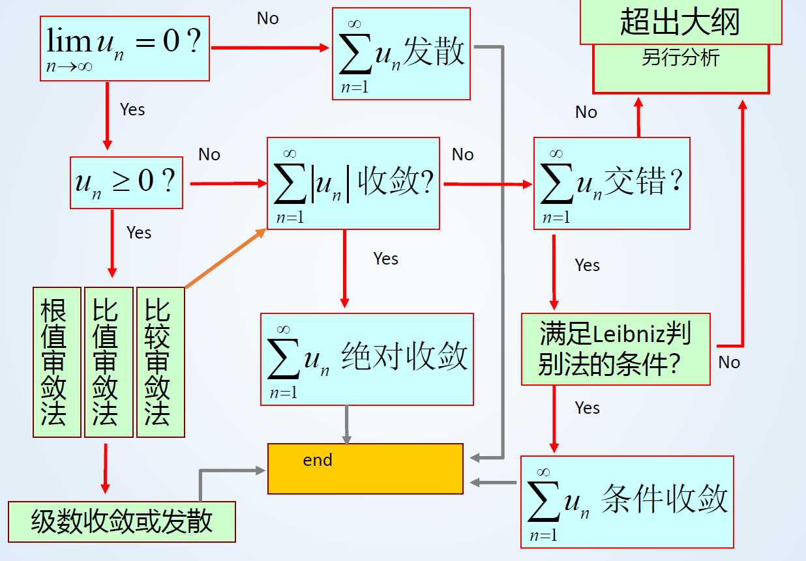

第十二章

# 级数的审敛法

因为按照定义法来判别级数的敛法性并不容易判断，大多数时候前 $n$ 项和很难求出，无法使用 $\lim_{n \to \infty} s_n$ 存在进行判断，所以引入一些新的审敛方法

下面按照级数的类型对审敛方法进行分类

## 正项级数

正项数列，每项都是大于0，且是一个单调递增的数列

对于正项级数有以下性质： **发 + 发 = 发**

### 利用正项级数收敛准则

有定理，若一个**正项级数** $\sum_{n=1}^{\infty} u_n$ 收敛，则其 $\{s_n\}$ 有上界，这是一个**充要条件**

### 比较审敛法

若有两个正项级数 $\sum_{n=1}^{\infty} u_n$ 和 $\sum_{n=1}^{\infty} v_n$，且 $0 \leq u_n \leq v_n (n=1,2,3,\dots)$ 则有

- **如果 $\sum_{n=1}^{\infty} v_n$ 收敛，则 $\sum_{n=1}^{\infty} u_n$ 也收敛**

- **如果 $\sum_{n=1}^{\infty} u_n$ 发散，则 $\sum_{n=1}^{\infty} v_n$ 也发散 (逆否命题)**

**推论：在 $v_n$ 前加上系数 $k (k>0)$ 即变成 $u_n \leq kv_n$ 上述结论依然成立**

>  巧记：大收推小收，小发推大发

还可以把比较审敛法写成极限形式

当 $\sum_{n=1}^{\infty} u_n$，$\sum_{n=1}^{\infty} v_n$ 满足 $\lim_{n \to \infty} {u_n\over v_n} = l$ ，则有

- **当 $0 < l \leq \infty$ 时，两个级数敛发性相同**
- **当 $l =0$ 时，如果 $\sum_{n=1}^{\infty} v_n$ 收敛，则 $\sum_{n=1}^{\infty} u_n$ 也收敛**
- **当 $l = \infty$ 时，如果 $\sum_{n=1}^{\infty} v_n$ 发散，则 $\sum_{n=1}^{\infty} u_n$ 也发散**

> 巧记：把 $v_n$ 和 $u_n$ 看做是两个无穷小的比较，若 $l = 0$ 说明 $u_n < v_n$，反之一样

由该方法可以得到一些结论，解题常用

**p-级数：** 形如 $\sum_{n=1}^{\infty} {1\over n^p} = 1 + {1\over 2^p}+ {1\over 3^p}+ {1\over 4^p} + \dots$ 叫做 p 级数，其中 p 为常数

- **当 $p \leq 1$ 时，级数发散**

- **当 $ p > 1$ 时，级数收敛**

> 证明 **当 $p \leq 1$ 时，级数发散**：可以拿 ${1\over n^p}$ 与 $1\over n$ 进行比较，因为我们已知调和级数 $1\over n$ 是发散的，而且 ${1\over n^p} \geq {1\over n}$ 所以按照比较审敛法判断，是发散的

**正项等比级数：** 形如 $\sum_{n=1}^{\infty} aq^{n-1}$

- **当 $0<q<1$ 时，级数收敛，收敛于 ${a \over 1-r}$**
- **当 $q \geq 1$ 时，级数发散**

如何使用比较审敛法

- 欲证正项级数 $\sum_{n=1}^{\infty} u_n$ **收敛**，则将 $u_n$ **适当放大**为 $v_n$，且级数 $\sum_{n=1}^{\infty} v_n$ 是**收敛**的
- 欲证正项级数 $\sum_{n=1}^{\infty} u_n$ **发散**，则将 $u_n$ **适当缩小**为 $v_n > 0$，且级数 $\sum_{n=1}^{\infty} v_n$ 是**发散**的

总结：使用该方法需要有较强的数学直觉

### 比值审敛法 (达朗贝尔判别法)

若有一个正项级数 $\sum_{n=1}^{\infty} u_n$ 且 $\lim_{n \to \infty}{{u_{n+1}}\over{u_n}} = \rho \quad (0 \leq \rho \leq +\infty)$

- **$0 \leq \rho < 1$ 时，$\sum_{n=1}^{\infty} u_n$ 收敛**
- **$1 < \rho \leq +\infty$ 时，$\sum_{n=1}^{\infty} u_n$ 发散**
- **$\rho = 1$ 时，可能收敛可能发散**

### 根值审敛法 (柯西判别法)

若有一个正项级数 $\sum_{n=1}^{\infty} u_n$ 且 $\lim_{ n \to \infty}\sqrt[n]{u_n} = \rho \quad (0 \leq \rho \leq +\infty)$

- **$0 \leq \rho < 1$ 时，$\sum_{n=1}^{\infty} u_n$ 收敛**
- **$1 < \rho \leq +\infty$ 时，$\sum_{n=1}^{\infty} u_n$ 发散**
- **$\rho = 1$ 时，可能收敛可能发散**

## 交错级数

形如 $\sum_{n=1}^{\infty} (-1)^{n-1}u_n = u_1-U_2+u_3-U_4+\dots+(-1)^{n-1}+\dots\quad (u_n>0) $ 的级数，出现正负交替的形式，叫做交错级数

### 莱布尼兹审敛法

**设一个交错级数满足**

- **$u_n \geq u_{n+1} > 0 \quad (n\in N)$ (逐项递减)**
- **$\lim_{n \to \infty} u_n =0$**

**则交错级数 $\sum_{n=1}^{\infty} (-1)^{n-1}u_n$ 收敛**

其中 $u_n$ 与 $u_{n+1}$ 的关系常用**比值判别法**得出

由此结合p级数可以得出常用结论

**交错p-级数：**

- 当 $p > 0 $ 时，级数收敛

## 任意项级数

- 任意级数 $\sum_{n=1}^{\infty} u_n$ 各项加绝对值后 $\sum_{n=1}^{\infty} |u_n|$，如果收敛，原级数也收敛，并且称为该级数为**绝对收敛**
- 若加了绝对值，级数发散，但是原级数收敛，则称级数 **条件收敛** (如：交错调和级数)

## 审敛一般步骤

