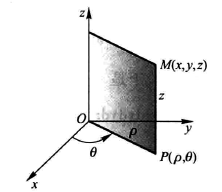
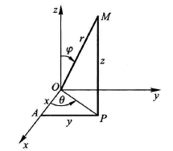

第十章

# 三重积分

与二重积分类似，三重积分也是求极限的和
$$
\iiint\limits_{\Omega} f(x,y,z)dv = \lim_{\lambda \to 0}\sum_{i=1}^n f(\xi_i,\eta_i,\zeta_i) \cdot \Delta\sigma_i
$$
只不过是将被积函数中多添加了变量 $z$

## 计算

### 直角坐标系

**第一步：**画出积分区域 $\Omega$ 的图像

**第二步：**将区域 $\Omega$ 投影到 $xOy$ 平面上，得到平面 $D_{xy}$

**第三步：**以平面 $D_{xy}$ 的边界为准线，做一条平行于 $z$ 轴的母线，使其穿过整个 $\Omega$ 区域，并与其相交于上下两点 $z_1(x,y),z_2(x,y)$ 

**第四步：**把 $x,y$ 看做定值，对 $z$ 先进行一次积分 $F(x,y) = \int_{z_1(x,y)}^{z_2(x,y)} f(x,y,z)dz$，得到只关于 $x,y$ 的函数 $F(x,y)$

**第五步：**对得到的函数 $F(x,y)$ 进行二重积分计算，即可得到结果

将上述过程整理，可得到在直角坐标系中**三重积分计算公式**
$$
\iiint\limits_{\Omega}f(x,y,z)dv=\int_a^bdx\int_{y_1(x)}^{y_2(x)}dy\int_{z_1(x,y)}^{z_2(x,y)}f(x,y,z)dz
$$

### 柱面坐标系

**柱面坐标系定义：**

柱面坐标系就是将原 $xOy$ 表示为极坐标系，而 $z$ 保留不变

**直角坐标系与柱面坐标系转化关系：**
$$
\left\{\begin{align}
x &= \rho\cos\theta \\
y &= \rho\sin\theta \\
z &= z
\end{align}\right.
$$

**计算公式：**
$$
\iiint\limits_{\Omega}f(x,y,z)dv=\int_{\theta_1}^{\theta_2}d\theta\int_{\rho_1}^{\rho_2}\rho d\rho\int_{z_1(\theta,\rho)}^{z_2(\theta,\rho)}f(\rho,\theta,z)dz
$$

### 球坐标系

**球坐标系定义：**

该坐标中只有 $\theta,\phi,r$ 三个参数，其中

- $r$ 是原点到 $M$ 的距离 $OM$，
- $\phi$ 是 $OM$ 与 $z$ 轴的夹角 ($0 \leq \rho \leq \pi$)
- $\theta$ 是点 $M$ 在 $xOy$ 上投影 $P$ 与原点练习 $PO$ 和 $x$ 轴的夹角 ($0 \leq x \leq 2\pi$)

**球坐标系与直角坐标系转化关系：**
$$
\left\{\begin{align}
x &= r\sin\phi\cos\theta \\
y &= r\sin\phi\sin\theta \\
z &= r\cos\phi
\end{align}\right.
$$

> 这里的 $r\sin\phi = OP$ 也相当于极坐标系里的 $\rho$

**计算公式：**
$$
\iiint\limits_{\Omega}f(x,y,z)dv=\int_{\theta_1}^{\theta_2}d\theta\int_{\phi_1}^{\phi_2}d\phi\int_{r(\phi,\theta)}^{r(\phi,\theta)}f(r,\phi,\theta)dr
$$
