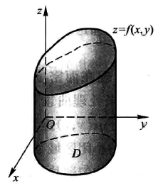

第十章

# 二重积分

## 定义

二重积分的出现是方便解决计算曲顶柱体的体积这类问题而出现的

>  如图所示为一个在 $xOy$ 面上以 $D$ 为底面，以 $z=f(x,y)$ 为高的曲顶面积。

由图可知，该曲顶柱体的高是随着 $x,y$ 两个变量而变化的，无法使用 **底面积 × 高** 的柱体体积公式进行计算

因此我们可用积分的思想来计算该柱体体积：

1. 先把底面 $D$ 拆分为若干小闭区域 $\Delta\sigma_1,\Delta\sigma_2，\dots，\Delta\sigma_n$，其中用 $\Delta\sigma_i$ 表示其中一个小闭区域
2. 在每个小闭区域 $\Delta\sigma_i$ 中找到一点 $(\xi_i,\eta_i)$ ，并得到以 $f(\xi_i,\eta_i)$ 为高，$\Delta\sigma_i$ 为底面积的若干**小平顶柱体** (此时圆顶弧度小，可近似看成平顶)
3. 对这 $n$ 个平顶柱体求和 $\sum_{i=1}^n f(\xi_i,\eta_i) \cdot \Delta\sigma_i$，此时得到的面积接近原圆顶柱体，但不够准确
4. 最后求极限，记 $\lambda$ 为所有小闭区域中直径最大的那个的值径值，有 $V = \lim_{\lambda \to 0}\sum_{i=1}^n f(\xi_i,\eta_i) \cdot \Delta\sigma_i$

此时，第四步的公式就被定义为**二重积分**
$$
\iint\limits_{D} f(x,y)d\sigma = \lim_{\lambda \to 0}\sum_{i=1}^n f(\xi_i,\eta_i) \cdot \Delta\sigma_i
$$

其中

- 被积函数： $f(x,y)$
- 被积表达式： $f(x,y)d\sigma$
- 面积元素： $d\sigma$
- 积分变量： $x,y$
- 积分区域： $D$
- 积分和： $\sum_{i=1}^n f(\xi_i,\eta_i) \cdot \Delta\sigma_i$

## 计算

**第一步：**先画出积分区域 D 的大致图像

**第二步：**根据形状判断是否存在对称关系，若有对称关系，直接使用[**对称性**](第十章-多重积分的定义和性质.md#多重积分性质)简化计算

**第三步：** 根据 D 的图像选用合适的方法

- 直角坐标
  - 先y后x
  - 先x后y
- 极坐标

### 直角坐标

**先y后x：**
$$
\iint\limits_{D} f(x,y)d\sigma = \int_{D在x轴的左边界值}^{D在x轴的右边界值}dx\int_{图像在下的函数y(x)}^{图像在上的函数y(x)}f(x,y)dy
$$
**先x后y：**
$$
\iint\limits_{D} f(x,y)d\sigma = \int_{D在y轴的下边界值}^{D在y轴的上边界值}dy\int_{图像在左的函数x(y)}^{图像在右的函数x(y)}f(x,y)dx
$$

### 极坐标

与直角坐标类似，不过 $\theta,\rho$ 的顺序是固定的，**先 $\rho$ 后 $\theta$**
$$
\iint\limits_{D} f(x,y)d\sigma = \int_{\theta起始}^{\theta结束}dy\int_{\rho 在D中最小值}^{\rho 在D中最值}f(x,y)dx
$$
